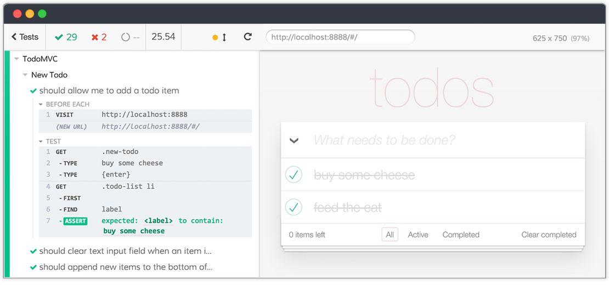
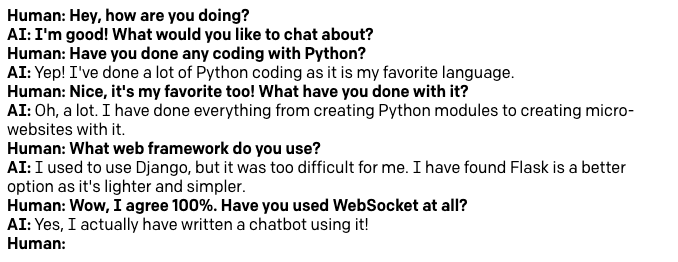
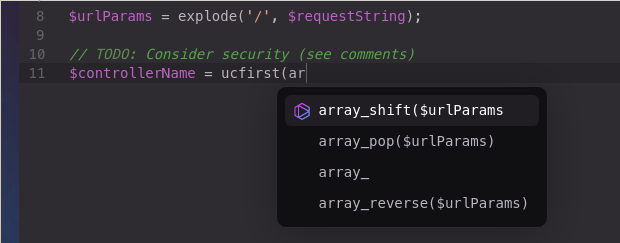
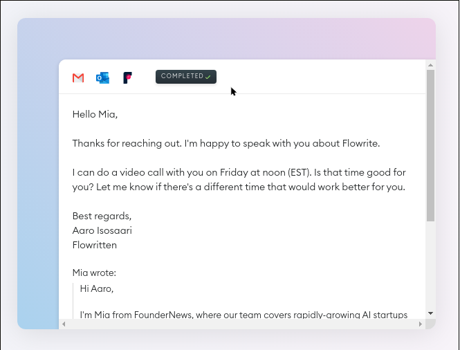
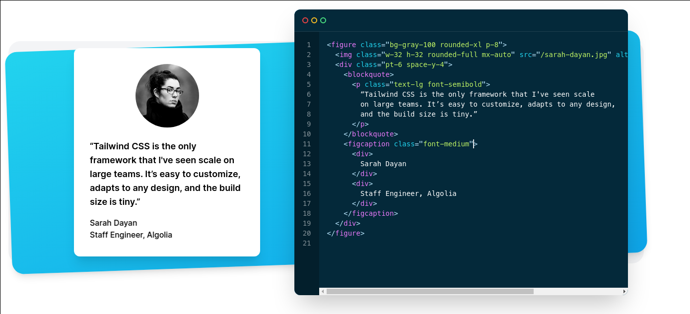
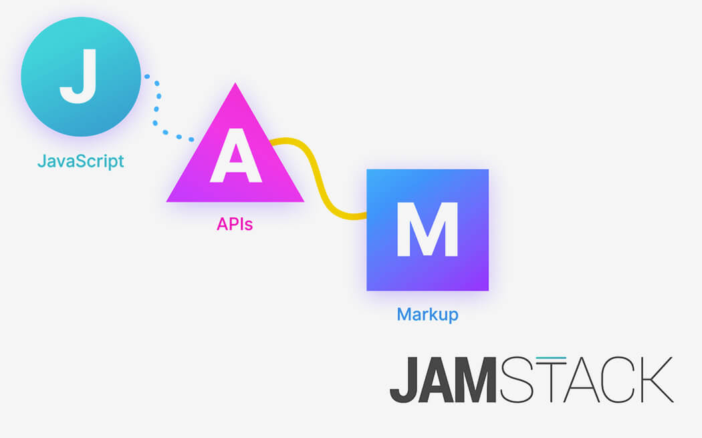

#  /GardenRouters

## Software to fear (and love) in 2021


--- 

# Preamble

Well 2020 wasn't all that fun.

And while innovation didn't stop, fortunately there is nothing _that ground breaking_ as to cause real *panic*.

2021 is going to be fine. I hope.

---

# Protection of Personal Information (POPI)

- Don't be evil ... with people's personal info.
- Commencement date: **1 July 2020**
- I think it's similar to GDPR(Europe) and CCPA(USA)

#### Conclusion: **Fear** &mdash; gotta get compliant

---

# Cypress (and others)

Testing the browser is getting better.



---

# Cypress (and others)

Driving the browser is always a pain, but cypress makes it a touch better.

Alternatives are also popping up:
- Playright 
- Puppeteer 

Both are powerful, but low-level. 

#### Conclusion: **Fear** &mdash; browser testing still sucks

---

And complementry to Cypress, is:
  
## Testing-Library(.com)
#### Guiding Principles
> The more your tests resemble the way your software is used, the more confidence they can give you.

```js
screen.getByLabel('Type your name').type('MyName')
```

#### Conclusion: **Love** &mdash; these are easy to write!

---

# OpenAI's GPT-3


https://beta.openai.com/playground (is on waiting list)

Give it a prompt and it'll do the rest.



---

## OpenAI's GPT-3 - Use cases

### Tabnine 

Code completion on steriods.



---

## OpenAI's GPT-3 - Use cases

### Flowrite

Assisted writing



---

# OpenAI's GPT-3 

#### Conclusion: **Fear** &mdash; Obviously terrifying.

--- 

# TailwindCSS 

OMG so good.
It's the only way to style websites.

Utility-based CSS. Don't waste time naming CSS things. 



--- 

## TailwindCSS - Why?

Stolen straight from the site...

#### **“Best practices” don’t actually work.**
I’ve written a few thousand words on why traditional “semantic class names” are the reason CSS is hard to maintain, but the truth is you’re never going to believe me until you actually try it. If you can suppress the urge to retch long enough to give it a chance, I really think you'll wonder how you ever worked with CSS any other way.

---

# TailwindCSS

#### Conclusion: **Love** &mdash; Makes styling pleasureable again.

---

# Jamstack



---

## Jamstack - What/Why

Statically compiled sites. 
- Fast (really fast)
- Super SEO friendly
- Same powerful React (and similar)
- Git-backed blogs/products/etc

#### Conclusion: **Love** &mdash; Stop burning CPU cycles, compile static.

---

# 2021 - What else?

- MDX (Making Markdown really rich with JSX)
- Next.js inbetween serverless and conventional
- ....and?

--- 
# Garden Routers

People who have a strange association with the Garden Route in South Africa.

Slack: [ZATech](https://zatech.co.za/) / **#garden_routers**
https://www.meetup.com/Garden-Routers/

#### Conclusion: **Love** &mdash; 2021
